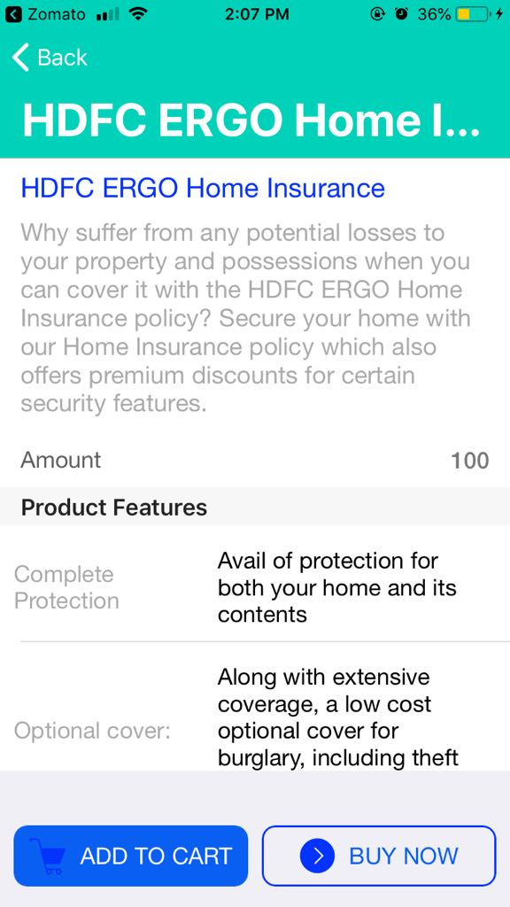

# App42Sample

App42 Sample App working on Shephertz SDK.

### Fetaures of App42SDK used in this samples are:
+ Create User
+ Login with authentication
+ Find Documennts from data base using Storage API
+ Get item based recommendation using Recommender API
+ Get loyaltiy points from Loyalty API
+ Localy saved Cart & wishlist Data using CoreData

